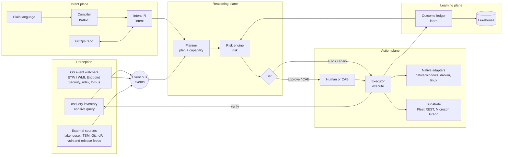

# 01 — Architecture

## Planes

ADM is organised as five planes around one loop. Each plane has a package
in `adm/` (in parentheses).



### Perception

Three sources feed one bus.

- **osquery** (through Fleet): inventory that refreshes on check-in, and
  live queries that answer in seconds. This is the only source ADM also uses
  to *verify* its own changes, on the device it touched.
- **OS event watchers** (in the ADM agent extension to fleetd): the
  instantaneous signal. On Windows, ETW providers and WMI event
  subscriptions (`Win32_VolumeChangeEvent`, `__InstanceModificationEvent` on
  `Win32_EncryptableVolume`, AppLocker and Firewall channels). On macOS,
  Endpoint Security (`ES_EVENT_TYPE_NOTIFY_MOUNT`, `NOTIFY_EXEC`, and the
  `AUTH_*` variants that can deny), plus managed-preference change
  notifications. On Linux, udev netlink for block devices, inotify on the
  configuration files ADM manages, D-Bus signals from systemd, login1 and
  NetworkManager, and eBPF where an LSM hook is the honest answer.
- **External sources**: the lakehouse (telemetry, driver events, compliance
  history), ITSM (tickets and approvals), Git (the GitOps repo and its
  merge requests), the IdP (group changes), vulnerability feeds
  (NVD, OSV, KEV, MSRC), release feeds (GitHub releases, Homebrew, winget,
  vendor RSS) and end-of-life data (endoflife.date).

Everything becomes a typed `events.Event` (`host.enrolled`,
`storage.attached`, `process.started`, `config.drift`, `vuln.published`,
`release.published`, `idp.group.changed`, ...). Redis streams carry them in
production, since Fleet already runs Redis; an in-memory bus backs tests.

### Intent plane

Plain language becomes an Intent IR (document 02). Two compilers exist: a
deterministic rule-based one for the common asks (and as the fallback), and
a Claude-backed one for open-ended language. Both produce the same IR, and
the IR is validated against the capability catalog before anything else
sees it. Every intent has a persistent GitOps rendering, so the repo is the
system of record for *what the fleet should look like*, in a form a human
reviews as a diff.

### Reasoning plane

The planner (`plan`) compiles an intent against the capability catalog and
the current inventory into steps per platform, each with its native binding,
its verification query and its rollback, grouped into rollout waves. The
risk engine (`risk`, document 03) scores the plan, applies hard invariants,
applies the policy floors, applies the intent's own autonomy cap, and
applies the adaptive leash for the pattern, then assigns a tier. Nothing in
this plane calls a language model: what the model proposed is now data.

### Action plane

The executor (`execute`) runs a plan wave by wave. For every host and step
it calls the native adapter's `Check` first; hosts already in the desired
state are skipped and reported as such. `Apply` captures the prior state so
`Revert` can restore it. After a wave, the executor nudges the agents and
runs the step's verification query on exactly those hosts; a wave whose
failure rate exceeds the threshold is reverted and the plan stops. Every
verification is also persisted as a Fleet policy, so drift stays visible in
Fleet's own UI and can drive Fleet's own automations.

Native adapters (document 04) are the point of the design. They realise a
capability through the OS's own interfaces. The substrate (`substrate`) is
what the adapters and the executor use to reach devices: Fleet's REST API
for inventory, live queries, MDM commands, profiles and declarations, scripts
(fallback) and policies; Microsoft Graph for Autopilot; and, on the device,
the ADM agent extension for local, millisecond-latency writes.

### Learning plane

Every proposal, approval, rejection, execution, verification, rollback,
incident and drift event is an `learn.Outcome`: one flat row, the schema of
the lakehouse table `adm_outcomes`. The ledger has two readers: the risk
engine, which derives the leash state for a pattern from its history, and
humans, through `explain`. Document 07 covers the lakehouse and the feedback
loop in detail.

## The loop, end to end

```mermaid
sequenceDiagram
    participant Op as Operator / agent
    participant C as Compiler (reason)
    participant P as Planner (plan)
    participant R as Risk (risk)
    participant H as Human / CAB
    participant X as Executor (execute)
    participant D as Device (native adapter)
    participant Q as osquery (verify)
    participant L as Ledger (learn)

    Op->>C: "Block USB drives on Finance Windows laptops, ask me first"
    C->>P: Intent (scope, predicates, cap: approve, confidence 0.93)
    P->>R: Plan (CSP step on 1 host, verify, rollback, waves)
    R-->>P: score 24, floor none, cap approve -> tier approve
    P->>L: proposed
    Op->>H: review (explain, simulate, GitOps diff)
    H->>P: approve (second person)
    P->>L: approved
    Op->>X: apply
    X->>D: Check (Get CSP nodes) -> not satisfied
    X->>D: Apply (Replace; Add on 404)
    X->>Q: verify (registry PolicyManager node = 1)
    Q-->>X: rows > 0
    X->>L: executed, verified
    Note over D,X: later: local admin flips the node back
    D->>X: config.drift event (WMI subscription)
    X->>P: micro-plan for that host
    P->>R: 1 host, proven pattern -> tier auto
    X->>D: Apply, verify
    X->>L: drift, verified
```

## How it sits on Fleet

ADM does not fork Fleet's server; it drives it. The mapping:

| ADM needs | Fleet provides today | ADM adds |
|---|---|---|
| Inventory and live query | osquery, `distributed/read`, live query campaigns over Redis and websockets (10 s floor) | The verification contract: every step proves itself with a query. |
| Instant nudge | ADR-0011 agent WebSocket "check now" (`server/agentws`), phase 1 for `distributed/read` | Nudge types for `orbit/config` and ADM actions; the agent extension that acts locally. |
| Apple management | nanomdm, ADE via ABM/ASM, DDM (configuration declarations only), APNs push, 30 s profile reconciler | Per-host declaration targeting, status subscriptions and activation predicates; Endpoint Security and NetworkExtension inside the agent. |
| Windows management | OMA-DM / SyncML / WSTEP, Entra automatic enrollment (Autopilot), 30 s profile reconciler, `mdm_bridge` local SyncML | CSP adapters over the local management stack (milliseconds), WMI and Win32 adapters, ETW/WMI event watchers; Autopilot write side through Graph. |
| Android | AMAPI policies, Pub/Sub push, enrollment tokens (QR, zero-touch), 30 s / 1 h reconcilers | Policy-field adapters, Knox and zero-touch orchestration. |
| Linux | fleetd, LUKS escrow, scripts | D-Bus, udev, netlink, dconf adapters; a real profile-equivalent. |
| Actions | Scripts (`/bin/sh`, `powershell -File`, 5 min cap, 5000-host batches), MDM commands, BitLocker via WMI, LUKS | The native action layer; scripts as flagged fallback. |
| Persistence | GitOps YAML (teams, policies, queries, profiles, scripts, software, labels), whole-set replace | The intent block and the projection of intents onto Fleet GitOps; every verification as a policy. |
| Conditional access | Entra compliance boolean via Fleet's proxy; Okta via Fleet as SAML IdP | Risk score and reason codes as the signal. |
| Software | Installers, Fleet-maintained apps (Homebrew and winget ingesters), VPP, policy-triggered automations, hourly vulnerability processing | Release watcher, package-manager hygiene, dependency CVEs, runtime end-of-life, Munki import. |
| AI surface | `cmd/fleet-mcp` (read plane, every tool read-only annotated), `ai_tools` and `mcp_listening_servers` tables, one LLM call for policy descriptions | The ADM MCP write plane with approval gates; AI-tool governance as a capability; the intent compiler. |
| Audit | ~200 activity types, activity webhooks | The outcome ledger and the leash. |

Two integration paths exist, and the scaffold takes the first:

1. **Control plane beside Fleet** (this scaffold): ADM is a separate module
   and process, talking to Fleet over its REST API with an API-only user, the
   same way `cmd/fleet-mcp` does. It can be deployed, upgraded and killed
   independently of the MDM substrate, which matters when a language model
   is in the loop.
2. **Bounded context inside Fleet** (later, per the modular-monolith
   direction in `docs/Contributing/architecture/modular-monolith`): the
   intent, plan and ledger tables move into the Fleet server as an `adm`
   context with its own service, datastore and activities, and the agent
   WebSocket carries ADM nudges natively. Nothing in the IR or the catalog
   changes.

## The agent side

fleetd stays the agent. ADM adds an extension with three jobs:

- **Watch.** Subscribe to the OS event sources above and publish
  `events.Event`s over the agent WebSocket (upstream direction; today the
  channel is server-to-agent only, so phase 1 reports through a new orbit
  endpoint and phase 2 makes the socket bidirectional).
- **Enforce locally.** Hold a signed, cached copy of the intents that apply
  to this device. When a watcher sees drift on a capability with a proven
  pattern and an auto tier, revert it locally within milliseconds and report
  the outcome, without a server round trip. The server remains the source of
  truth; the agent is the fast path.
- **Act natively.** Expose the native adapters to the server: on Windows,
  `ApplyLocalManagementSyncML` (already used by fleetd's `mdm_bridge` table)
  for CSP reads and writes, WMI and Win32 calls; on macOS, an Endpoint
  Security client and a content-filter NetworkExtension inside a system
  extension, plus direct invocation of Apple binaries (`fdesetup`,
  `sysadminctl`, `socketfilterfw`) with argument vectors, never a shell; on
  Linux, D-Bus method calls, udev rules, netlink and dconf.

## Scale and latency

- Per-device work is O(intents that apply to the device), evaluated on the
  device's events, so a 100k-device fleet does not do 100k things every 30
  seconds; it does one thing when one thing changes.
- Fleet-wide changes are waves, sized by policy, so a plan never issues more
  than a wave's worth of concurrent actions, and the executor's nudge pacing
  (which ADR-0011 gives the server for free) spreads the check-ins.
- Verification is targeted: a live query only to the hosts in the wave, not
  a campaign against the fleet.
- The lakehouse, not MySQL, is where history accumulates; the ledger is
  append-only JSON lines or a stream, and the leash is a small derived state
  per pattern.
