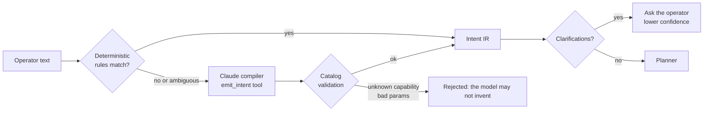

# 02 — Intent model

## What an intent is

An intent is the persistent statement of a desired fleet state. It is the
unit ADM manages, versions, reconciles and explains.

```json
{
  "id": "intent-7f3a",
  "text": "Block USB drives on Finance Windows laptops, ask me first",
  "author": "alice",
  "source": "nl",
  "scope": { "fleets": ["Finance"], "labels": ["laptops"], "platforms": ["windows"] },
  "desired": [
    { "capability": "storage.removable.block", "params": { "mode": "block" },
      "rationale": "operator asked to block USB drives" }
  ],
  "constraints": { "max_autonomy": "approve" },
  "verification": [],
  "state": "active",
  "version": 1,
  "provenance": { "compiler": "claude", "model": "claude-opus-5", "prompt_hash": "9c1e...", "confidence": 0.93 }
}
```

The parts, and the rule each one enforces:

- **Scope** selects devices with AND semantics over fleets (Fleet teams),
  labels, excluded labels, platforms, explicit host IDs and an optional live
  osquery predicate. An empty scope is rejected unless the intent explicitly
  says `allow_fleet_wide`, so "everywhere" is always a deliberate word.
- **Desired** is a list of predicates: a capability from the catalog and its
  parameters. Capabilities are the vocabulary (document 06); the catalog, not
  the compiler, decides how a predicate is realised on each platform.
- **Constraints** bound how ADM may act: a maximum autonomy (the risk engine
  may be more conservative, never less), a maintenance window, canary
  percentage, wave size, maximum user impact, a deadline.
- **Verification** is optional operator-supplied osquery that must hold
  after the change; the catalog contributes the default verification for
  every capability and platform.
- **Provenance** records which compiler and model produced the intent, a
  hash of the prompt, and the compiler's confidence. Confidence is a risk
  factor: a hesitant compilation gets less autonomy.

Two derived keys matter:

- `Fingerprint()` hashes scope, desired and constraints. Two intents with
  the same fingerprint mean the same thing regardless of wording.
- `PatternKey()` is the capabilities plus platforms, independent of scope
  size (`storage.removable.block@windows`). The adaptive leash is keyed on
  it: what earns trust is *the kind of change*, not the particular devices.

## From language to intent



Two compilers produce the same IR:

- **Deterministic** (`reason.Deterministic`): rules for the asks every IT
  team makes: encryption, firewall, screen lock, removable storage, AI
  tools, web blocking, software floors, package-manager hygiene, OS updates,
  lock, wipe, signage, plus scope words (team and label names from the
  tenant, platform words, "everywhere") and autonomy words ("ask me first",
  "gradually", "just watch", "automatically"). It runs offline, in
  microseconds, and it is the fallback when the model is unavailable.
- **Claude** (`reason.Claude`): the model gets a stable, cached system
  prompt containing the catalog and the rules, the tenant's fleet and label
  names, and the operator's text, and must answer by calling one tool,
  `emit_intent`, whose input *is* the IR plus a confidence and a list of
  clarifying questions. The model never sees a device and never executes;
  its output is validated against the catalog and rejected if it names a
  capability or parameter that does not exist. Server-side refusal fallback
  is enabled so a declined request is re-served by a fallback model in the
  same call.

Rules the compilers share:

1. Never invent. Unknown asks become clarifications, not guesses.
2. Scope reflects words. "Finance" maps to the Finance fleet only because
   the tenant has one; "all laptops" sets `allow_fleet_wide`; no scope words
   means a question back to the operator.
3. "Keep it secure" is a known baseline (encryption, firewall, screen lock),
   not an invitation to improvise.
4. Destructive capabilities (`host.wipe`) require an explicit ask and always
   come with a confirming clarification.
5. Confidence is honest: below 0.6 when the compiler guessed, capped at 0.7
   when it had to ask something.

## From intent to plan

The planner (`plan.Planner.Compile`) does the following, in order:

1. Validate the intent structurally, then every predicate against the
   catalog (capability exists, required params present, types right).
2. Select hosts: the locally evaluable scope (fleets, labels, exclusions,
   platforms, IDs) against the substrate's inventory; the live osquery
   predicate, when present, against the substrate.
3. For each predicate and each platform with hosts, look up the binding. No
   binding means an `Unsupported` entry the plan carries and `explain`
   surfaces; it never means a silent skip and never a script.
4. Emit a `Step` per (capability, platform): mechanism, native interface,
   adapter, params, the host IDs, reversibility, the rendered verification.
5. Emit the rollback: reversible steps in reverse order.
6. Score risk (document 03) and evaluate invariants, per step and per
   capability across the plan, so a rule about blast radius sees the total.
7. Build waves: a canary wave whenever the tier asks for one or the rollout
   is larger than a wave, then waves of at most `max_wave_hosts`.
8. Render the GitOps form.

A plan is executable only when it has steps, violates no invariant, is not
observe-only, and carries the approval its tier requires (with a change
ticket at the CAB tier).

## Persistence: intents in GitOps

Every plan renders to YAML with two parts:

```yaml
# ADM intent intent-7f3a (v1) — Block USB drives on Finance Windows laptops, ask me first
# fingerprint: 3b9e1c0f2a7d44e1  pattern: storage.removable.block@windows  tier: approve  score: 24
adm:
  intents:
    - id: intent-7f3a
      text: "Block USB drives on Finance Windows laptops, ask me first"
      author: "alice"
      scope:
        fleets:
          - "Finance"
        labels:
          - "laptops"
        platforms:
          - windows
      desired:
        - capability: storage.removable.block
          params:
            mode: "block"
          rationale: "operator asked to block USB drives"
      constraints:
        max_autonomy: approve
# Fleet GitOps projection (generated; do not edit by hand)
policies:
  - name: "ADM storage.removable.block (windows)"
    platform: windows
    description: "Verifies ADM intent intent-7f3a: Block USB drives on Finance Windows laptops, ask me first"
    resolution: "ADM reconciles this automatically; see adm explain plan-..."
    query: "SELECT 1 FROM registry WHERE path LIKE '...PolicyManager\\current\\device\\Storage\\RemovableDiskDenyWriteAccess' AND data = '1'"
```

The `adm:` block is the source of truth for the intent. The projection
below it is what Fleet itself understands today: `controls` for capabilities
Fleet manages declaratively (`enable_disk_encryption`, OS update deadlines)
and a `policies` entry for every verification, so drift shows in Fleet's UI
and Fleet's policy automations can trigger remediation even when ADM is
down. ADM opens the change as a merge request; merging it is the persistent
act, and reverting the commit is the persistent undo.

## Lifecycle

`draft` (compiled from language, may carry clarifications) → `compiled`
(a plan exists) → `active` (a plan verified; the intent is now reconciled on
events) → `paused` (a rollback or an operator pause; reconciliation stops)
→ `retired`. Intents are versioned; editing one produces a new version and
a new plan, and the ledger keeps the lineage.

## Reconciliation on events

An active intent is re-evaluated when an event the trigger table maps to one
of its capabilities arrives (`events.DefaultTriggers`): `storage.attached`
touches `storage.*` intents, `process.started` touches `ai.tools` and
`edr.*`, `software.changed` touches software and runtime intents,
`vuln.published` touches software and update intents, `host.enrolled` and
`idp.group.changed` re-scope everything. The service compiles a one-host
micro-plan, scores it (small blast radius, known pattern), and runs it
unattended when the tier allows, or leaves a plan waiting for approval when
it does not. A `sweep` event, published on a schedule, does the same for
every intent and every host: it is the safety net, not the mechanism.
