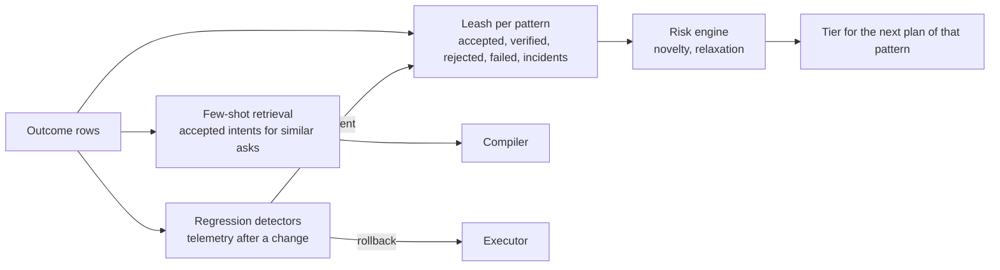

# 07 — Data and learning

## The reference architecture ADM generalises

The design brief describes a client-platform agent already running at
scale: it perceives from a lakehouse (telemetry, driver events, compliance),
from Fleet live queries across about 75,000 endpoints, from ITSM, Git and
change tickets; it reasons with a model behind an inference API, finds
tables through a schema catalog, writes SQL, cross-references, and scores
risk against a change model; it acts by opening merge requests, filing
tickets, kicking off staged releases and running live osquery through a
Fleet MCP server; low risk auto-executes, medium and high wait for a human;
and everything it does is written back to lakehouse tables so good answers
get faster and accepted suggestions loosen the leash for that pattern.

ADM is that loop made a product: the schema catalog is the capability
catalog plus the osquery schema, the change model is the risk engine, the
merge request is the GitOps rendering, the staged release is the wave plan,
the tickets are the CAB tier, the write-back is the ledger, and "loosen the
leash" is `risk.LeashState`.

## External sources

| Source | What ADM reads | What ADM writes | Event |
|---|---|---|---|
| Lakehouse (Delta / Iceberg over object storage) | Telemetry history, driver and crash events, compliance history, prior outcomes | `adm_outcomes`, `adm_intents`, `adm_plans` | `config.drift`, `vuln.published` from detectors |
| Fleet | Inventory, live query, policies, activities | Profiles, declarations, commands, policies, scripts | `host.enrolled`, `host.online`, `policy.failing`, `host.label.changed` |
| ITSM (ServiceNow, Jira) | Change tickets, approvals, incidents | Change requests for CAB plans, incident links | `ticket.approved` |
| Git (the GitOps repo) | Intents, current desired state | Merge requests with the rendered intent | `intent.changed` |
| IdP (Entra, Okta, Google) | Users, groups, device trust state | Compliance signal with score and reasons | `idp.group.changed` |
| Vulnerability feeds (NVD, OSV, KEV, MSRC, OVAL) | New CVEs matched to inventory | — | `vuln.published` |
| Release feeds (GitHub, Homebrew, winget, vendor) | New versions, checksums, signatures | — | `release.published` |
| End-of-life data (endoflife.date) | Runtime and OS cycles | — | `runtime.eol` |
| SIEM / EDR | Detections on managed devices | Enrichment | `process.started`, incidents |

Every source is a connector that publishes typed events and answers typed
queries; the agent reaches them through MCP where a server exists (Fleet,
lakehouse SQL, ITSM, Git) and through native connectors otherwise.

## The ledger

`learn.Outcome` is one flat row, deliberately: it is the schema of the
lakehouse table `adm_outcomes`, written as JSON lines by the scaffold and as
Parquet by the production sink.

| Column | Meaning |
|---|---|
| `at`, `kind` | When, and which of: proposed, approved, rejected, executed, verified, failed, rolled_back, incident, drift, feedback |
| `intent_id`, `plan_id`, `pattern`, `fingerprint`, `capabilities` | What |
| `tier`, `score` | What the risk engine decided |
| `hosts`, `host_id`, `platform` | Where |
| `actor` | Who (a person, `adm-reconciler`, `mcp:<principal>`) |
| `success`, `message`, `duration`, `evidence` | How it went, including the native call that was made |

Three tables sit beside it: `adm_intents` (the IR, versioned),
`adm_plans` (steps, waves, risk, approvals, GitOps rendering) and
`adm_leash` (the derived per-pattern state, materialised for dashboards).

## The feedback loop

1. **Autonomy calibration.** `learn.Leash` folds a pattern's history into
   `risk.LeashState`; document 03 describes how it moves tiers. A human
   approval, a verified unattended run and a positive feedback row all count
   as acceptance; a rejection, a failed verification, a rollback or an
   incident count against it, and incidents suspend relaxation for the
   cooldown.
2. **Compiler improvement.** Accepted intents and their prompts are the
   retrieval set for the Claude compiler: the closest accepted intents for a
   similar ask are shown as examples, so the tenant's own vocabulary
   ("the design team" means a label, "kiosk" means one specific app) is
   learned without fine-tuning.
3. **Regression detection ("phenomena").** After a plan verifies, a detector
   compares the affected hosts' telemetry against their own baseline and
   against unaffected peers over a window: crash rate, driver events, help
   desk tickets tagged to the device, sign-in failures, CPU and battery.
   A regression attributable to the change becomes an `incident` row, which
   tightens the leash, and, for a plan still inside its waves, a rollback.
   This is what makes "fleet changes are persistent and even improved
   upon" true: the change stays because it kept being good.
4. **Operator feedback.** `feedback` rows carry a thumbs up or down and a
   note from the person who approved or lived with a change; negative
   feedback counts as a rejection for the leash.

## The reasoning agent

Beyond compiling operator language, the same machinery runs an agent that
proposes intents from data:

- It watches the event bus and the lakehouse for conditions with a known
  remedy (a CVE against an installed version; a runtime past end-of-life; a
  device that failed the same verification three times; a new office's
  devices lacking a baseline every other office has).
- It proposes an intent with a rationale and its own confidence, through the
  same `Propose` path a human uses, so it gets the same plan, score, tier and
  gates. A proposal from telemetry never starts above the tier the pattern
  has earned, and a novel proposal always waits for a person.
- It writes back what it saw, what it proposed and what happened, so the
  next proposal of that kind is faster and the leash reflects it.

The agent's tools are MCP servers: Fleet's for reading devices, ADM's for
proposing and (when allowed) applying, the lakehouse's for SQL over history,
the ITSM's for tickets, Git's for merge requests. Nothing in it needs Fleet
specifically; it needs a substrate that answers questions in seconds and a
control plane that turns answers into gated, reversible, verifiable
actions.
